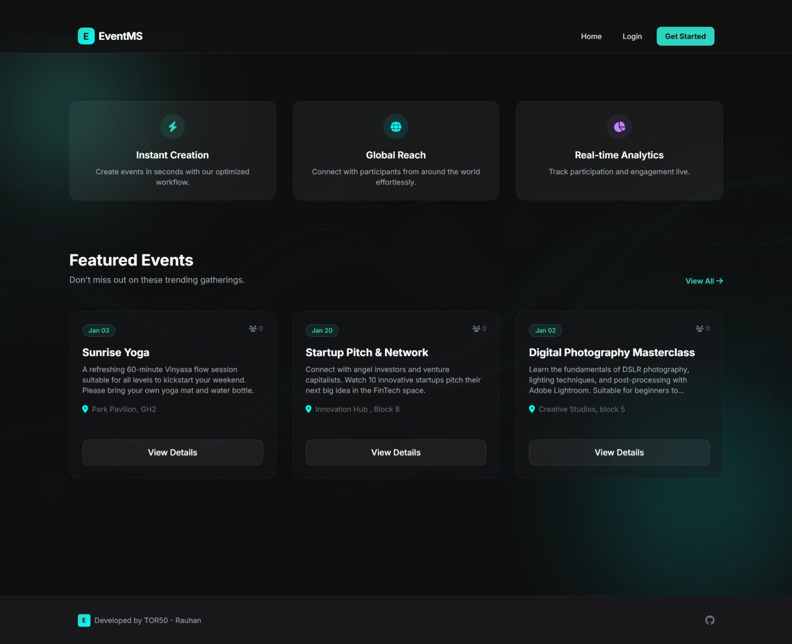
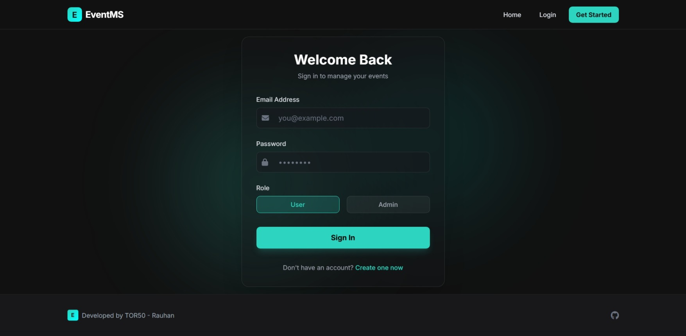
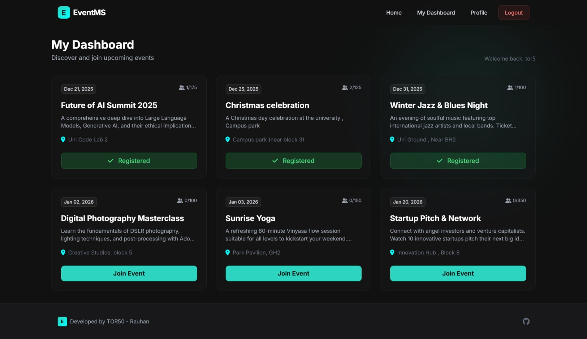
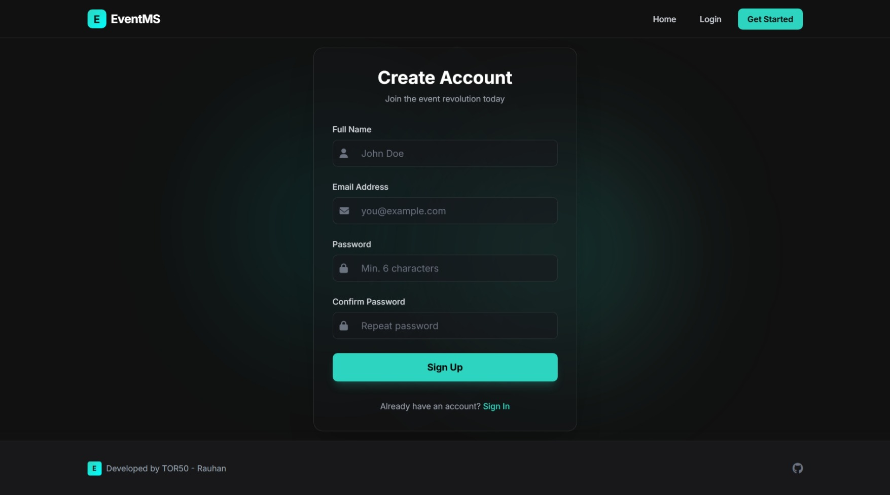
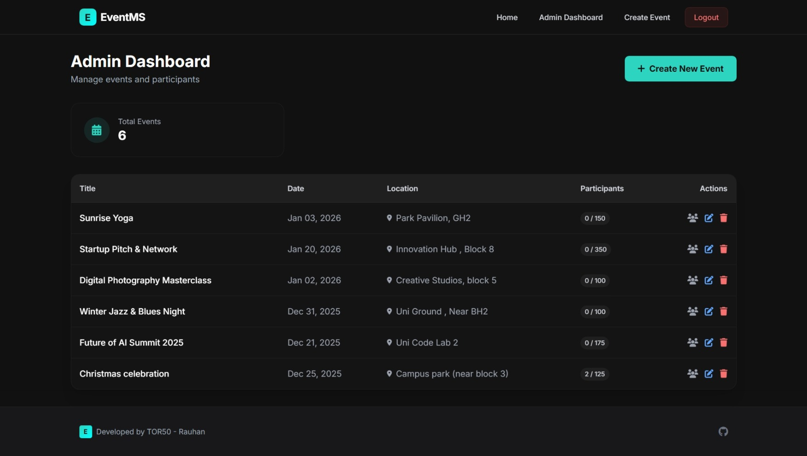
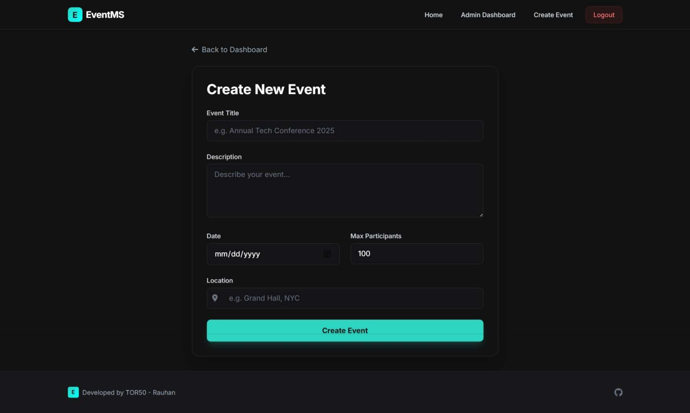
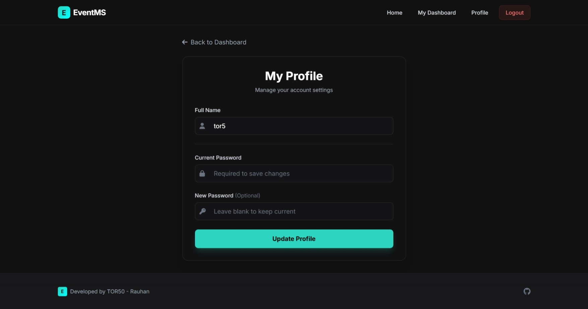

# 🚀 Event Management System (EventMS)

**A Futuristic, High-Performance Event Management Platform built with PHP & Modern UI.**



## ✨ Features

- **Futuristic UI/UX**: Designed with a "Dark/Teal" glassmorphism aesthetic for a premium feel.
- **Fluid Animations**: Button hovers, card glows, and seamless page transitions.
- **User Dashboard**: Manage registrations, view ticket status, and profile settings.
- **Admin Panel**: Create, edit, and delete events with a powerful interface.
- **Responsive Design**: Fully optimized for mobile, tablet, and desktop.
- **Secure Auth**: Robust login and registration system.

## 📸 Showcase

### 🖥️ User Experience
| Login Page | User Dashboard |
|:---:|:---:|
|  |  |

**Create Account**


### 🛠️ Admin Capabilities
| Admin Dashboard | Create Event |
|:---:|:---:|
|  |  |

**Profile Management**


## 🚀 Tech Stack

- **Backend**: PHP (Native) + MySQL
- **Frontend**: Tailwind CSS v3 (via PostCSS/Vite)
- **Tooling**: Vite (for asset optimization), npm
- **Design**: Custom Glassmorphism System

## 📦 Deployment Guide

### Option 1: Free Hosting (InfinityFree / 000webhost)

1.  **Database**: Export your local `event_management` database to `.sql`. Import this into your host's PHPMyAdmin.
2.  **Files**: Upload the **entire content** of the `event_management` folder to your server's `public_html` or `htdocs`.
    - *Crucial*: Ensure the `dist/` folder is uploaded (this contains the styled CSS/JS).
3.  **Config**: Edit `includes/config.php` on the server:
    ```php
    define('DB_HOST', 'sql123.infinityfree.com'); // Your Host
    define('DB_USER', 'if0_12345678');           // Your User
    define('DB_PASS', 'password');               // Your Password
    define('DB_NAME', 'if0_12345678_events');    // Your DB Name
    define('BASE_URL', 'http://your-site.rf.gd/');// Your Domain
    ```

### Option 2: Local Setup

1.  Clone the repo.
2.  Run `npm install` inside the root.
3.  Start backend: `php -S localhost:8000 -t event_management`
4.  Start assets: `npm run dev`

---
<div align="center">
    <strong>Developed by TOR50 - Rauhan</strong><br>
    <a href="https://github.com/TOR50/EVENT_MANAGER_PHP">GitHub Repository</a>
</div>
