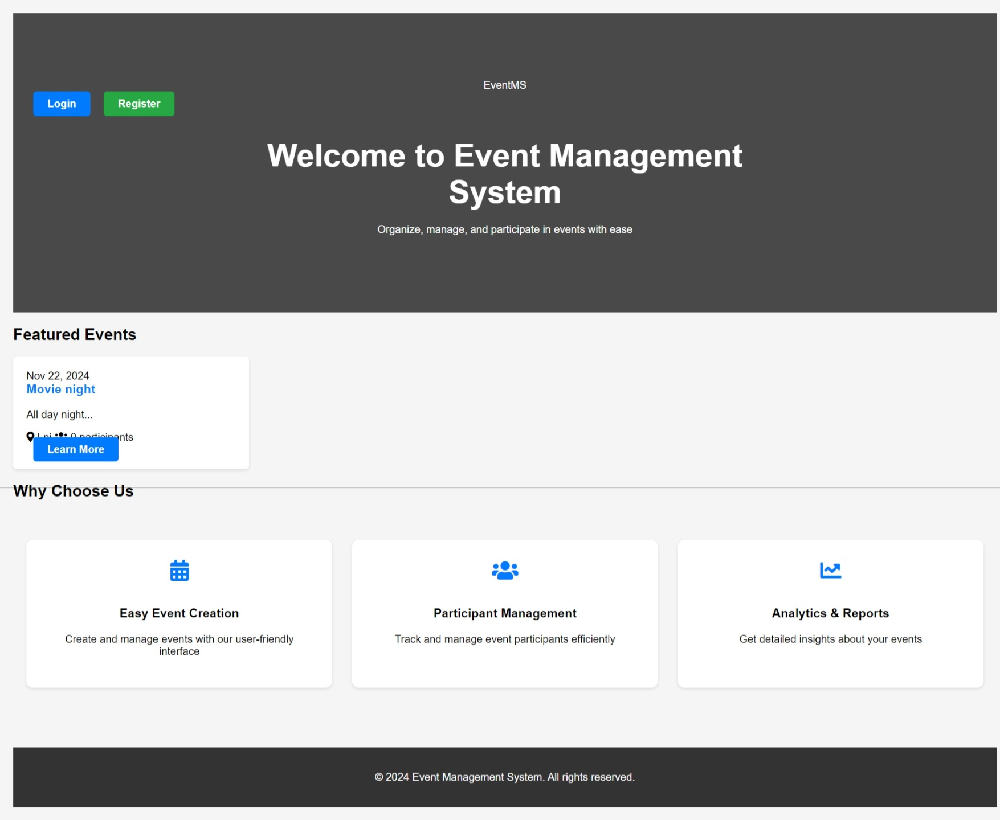
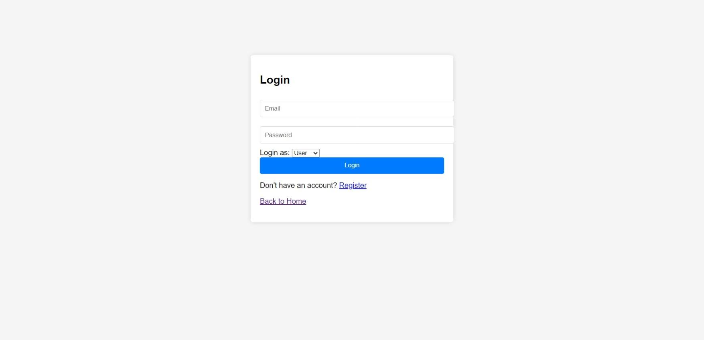
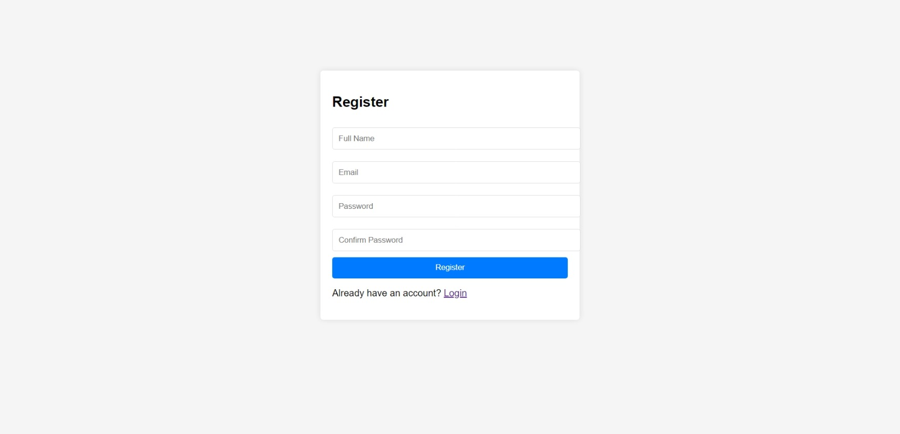
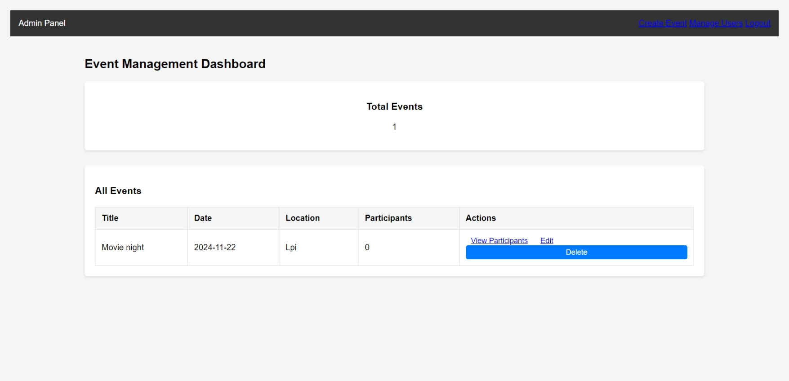
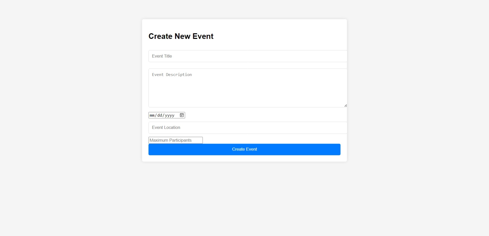
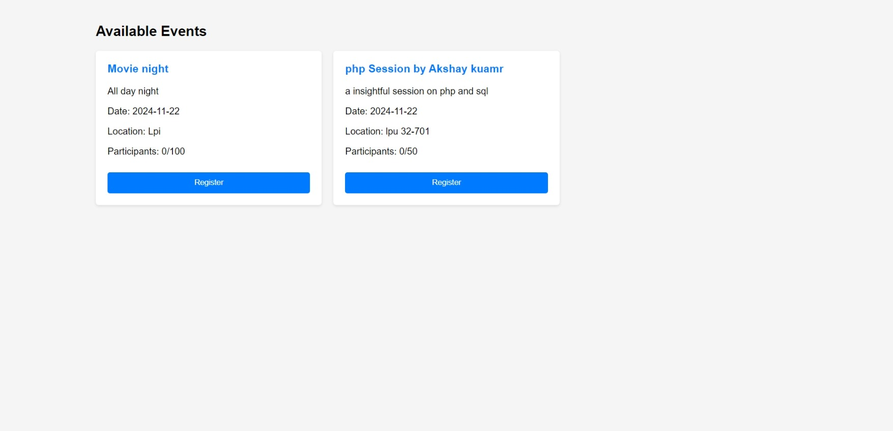

# EVENT_MANAGER_PHP
Event Management System The Event Management System is a web-based application designed to help users organize, manage, and participate in events with ease. This system provides a comprehensive solution for event organizers and participants, offering features such as event creation, participant management, and detailed analytics.










## Features

- **User Authentication**: Secure login and registration system with role-based access control (admin and user roles).
- **Event Creation and Management**: Admins can create, edit, and delete events, set event details, and manage participant registrations.
- **Participant Management**: Track and manage event participants efficiently, with options to export participant lists to CSV and print them.
- **Analytics and Reports**: Get detailed insights about events, including total events, upcoming and past events, and popular events. Visualize data with charts for monthly registrations and popular events.
- **Responsive Design**: User-friendly interface that works seamlessly on both desktop and mobile devices.

## Project Structure

```
admin/
    analytics.php
    create_event.php
    dashboard.php
    view_participants.php
assets/
    css/
        style.css
    images/
    js/
        export.js
        validation.js
includes/
    auth.php
    config.php
    functions.php
    mailer.php
index.php
login.php
logout.php
register.php
sql.txt
user/
    dashboard.php
    participate.php
    profile.php
```

## Installation

1. Clone the repository:
    ```sh
    git clone https://github.com/TOR50/EVENT_MANAGER_PHP.git
    ```
2. Navigate to the project directory:
    ```sh
    cd event_management
    ```
3. Set up the database:
    - Create a MySQL database named `event_management`.
    - Import the SQL schema from 

sql.txt

 into the database.
4. Configure the database connection in 

config.php

:
    ```php
    define('DB_HOST', 'localhost');
    define('DB_USER', 'root');
    define('DB_PASS', '');
    define('DB_NAME', 'event_management');
    ```
5. Start the web server (e.g., XAMPP) and navigate to the project URL (e.g., `http://localhost/event_management`).

## Usage

- **Admin Dashboard**: Access the admin dashboard to manage events and view analytics.
- **User Dashboard**: Users can view available events, register for events, and manage their profiles.
- **Login and Registration**: Securely log in or register as a new user.

## Contributing

Contributions are welcome! Please fork the repository and create a pull request with your changes.


## Contact

For any inquiries or support, please contact [rauhan.official@gmail.com](mailto:rauhan.official@gmail.com).
